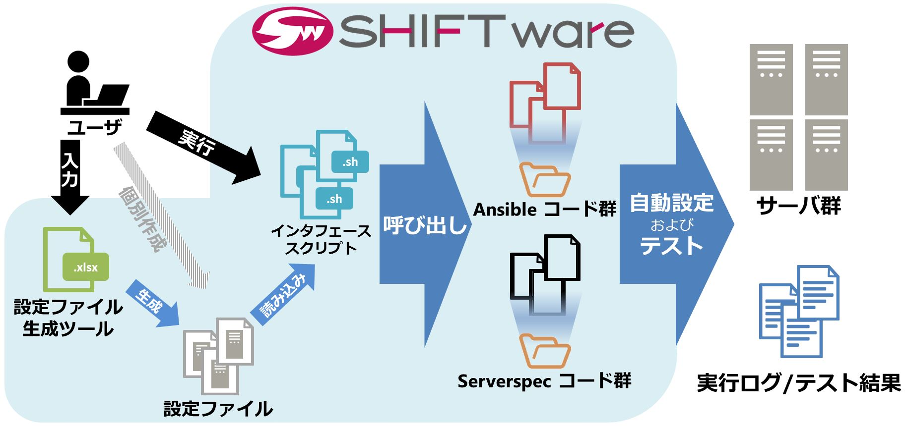

## **SHIFT ware について**
### ==SHIFT ware とは==
**SHIFT ware** は **IaC** [^1]の技術を統合した自動化のフレームワークであり、より早く品質の良いシステムの構築・保守・運用管理を実現できます。

[^1]: Infrastructure as Code

### ==SHIFT ware のコンセプト==

* 従来の（延長線の）やり方から転換 
* （ユーザ目線で）便利な、インフラ標準フレームワーク 

### ==SHIFT ware の特徴==

* **【自動構築・自動テスト】**
	* SHIFT wareでは様々なOS・ミドルウェアに対する自動構築・自動テストを行うコードを用意しているため、誰でも直ぐに利用を開始できます。
* **【インフラのコードテンプレート集】**
	* SHIFT wareはシステムインテグレーションのノウハウを元にインフラをコード化したテンプレート集であり、多くのプロジェクトに実際に採用されています。
* **【スキル不問】**
	* SHIFT wareでは簡単に利用できるように、フロントエンドツールを用意しています。プログラミングの経験がないインフラエンジニアであっても使用することができます。
* **【オープンソースソフトウェア】**
	* SHIFT wareはオープンソースとして公開されています（Apache License version 2.0）。そのため利用に際してライセンスコストが不要です。

### ==SHIFT ware の利用イメージ==

### ==SHIFT ware の利用シーン==

**クラウド・オンプレミスでの利用**

AWSやAzureなどのパブリッククラウド上、オンプレミス上のシステムに対応しています。

**大量の構築作業**

一度に大量のシステムを構築するなど、あるいは他のプロジェクトなどで共通化されており流用可能なシステムが多くある場合などは有効です。

**構築後のパッチ適用**

脆弱性の確認であったり、パッチの適用であったりする保守・運用面で手間がかかっているものに対して、ツールやテンプレートを上手に活用することで人の作業が減り、相対的なヒューマンエラーの回避にもつながります。

### ==SHIFT ware の対応範囲==

